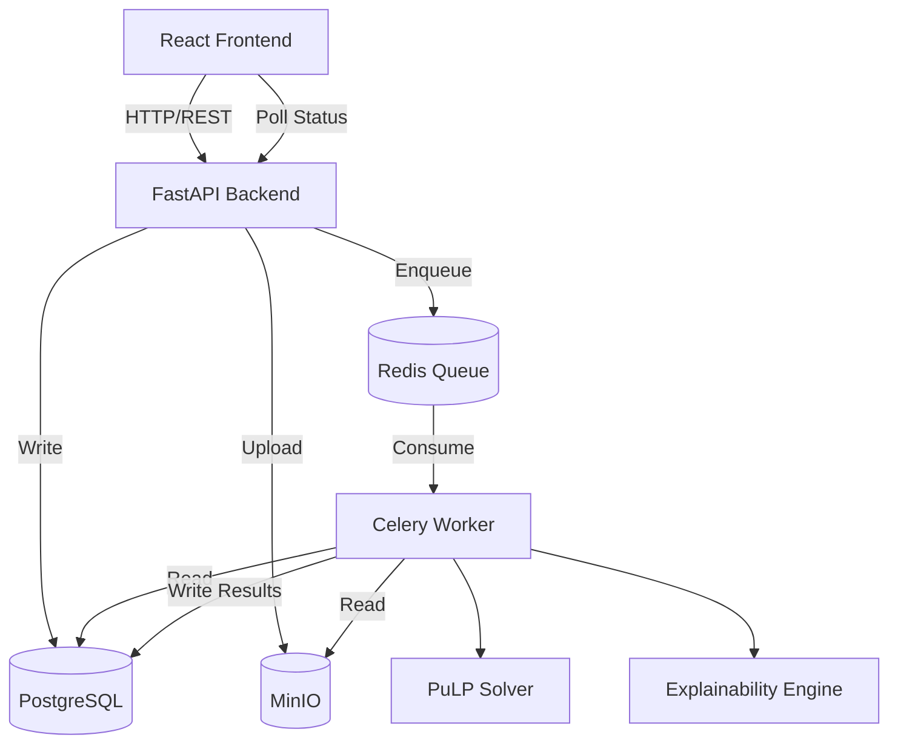

# 🚀 ApexS: Explainable Sprint Planner


## 1. Project Overview

Manual sprint planning is notoriously difficult. Engineering managers and scrum masters often rely on gut feeling or simple heuristics to balance developer capacity, business value, technical risk, and required skills. This leads to unbalanced sprints, over-commitment, and delayed deliverables.

**ApexS** solves this by applying **Integer Linear Programming (ILP)** to mathematically generate the optimal sprint backlog. Instead of guessing, the platform evaluates thousands of combinations to maximize business value while strictly adhering to capacity and risk constraints. Crucially, the platform features an **Explainability Engine** that translates mathematical constraint violations into human-readable feedback, ensuring transparency in every planning decision.

---

## 2. Features

- **Backlog Optimization**: Maximizes total business value delivery within strict capacity boundaries using the PuLP/CBC solver. Eliminates human bias in sprint planning.
- **Explainability**: Translates complex ILP constraints into plain English. Provides exact reasons for why specific stories were rejected (e.g., "Exceeds backend skill capacity by 3 points").
- **Asynchronous Optimization**: Heavy computational ILP workloads are offloaded to Celery workers, keeping the HTTP layer responsive.
- **Manual Review Workflow**: Interactive Kanban interface allows human-in-the-loop overrides. Engineers can modify solver boundaries and approve final plans.
- **Persistence**: Generated plans, explanations, and historical data are durably stored in PostgreSQL for auditability and future learning.
- **Dataset Upload**: Seamlessly ingest bulk backlog data via CSV directly into MinIO object storage for scalable processing.

---

## 3. Architecture

ApexS employs a decoupled, asynchronous microservices architecture to handle heavy computational workloads without blocking user interactions.



### Service Responsibilities & Decisions
- **FastAPI**: Handles immediate HTTP requests, routing, and data validation.
- **Celery Worker**: Executes the CPU-bound ILP optimization and explanation extraction in the background.
- **Redis**: Acts as the high-throughput message broker between FastAPI and Celery. Essential for decoupling the web layer from the solver.
- **MinIO**: S3-compatible object storage for handling large, unstructured CSV uploads before they are processed.
- **PostgreSQL**: Relational storage for structured entities (Sprints, Stories, Plans). Chosen over temporary memory to guarantee durability, support complex joins, and enable historical reporting.

---

## 4. Optimization Engine

The core of ApexS is an Integer Linear Programming (ILP) formulation solved via PuLP/CBC.

### Mathematical Formulation

Let $N$ be the set of all candidate user stories.

**Decision Variables:**
$$ x_i \in \{0, 1\} \quad \forall i \in N $$
*(1 if story $i$ is included in the sprint, 0 otherwise)*

**Objective Function:**
Maximize total business value:
$$ \text{Maximize} \sum_{i \in N} (\text{Value}_i \times x_i) $$

**Constraints:**
1. **Capacity Constraint**: The total story points cannot exceed the team's sprint velocity.
   $$ \sum_{i \in N} (\text{Points}_i \times x_i) \le \text{Max Capacity} $$
2. **Risk Constraint**: The total accumulated risk score cannot exceed the team's threshold.
   $$ \sum_{i \in N} (\text{Risk}_i \times x_i) \le \text{Max Risk} $$
3. **Dependency Constraints**: If story $i$ depends on story $j$, story $j$ must be included if $i$ is included.
   $$ x_i \le x_j $$
4. **Skill Constraints**: Total points for a specific skill (e.g., Backend) cannot exceed the available capacity for that skill.
   $$ \sum_{i \in \text{Skill}_k} (\text{Points}_i \times x_i) \le \text{Skill Capacity}_k $$

---

## 5. Explainability Engine

The explainability engine bridges the gap between mathematical optimization and human reasoning. After the ILP solver completes, the engine analyzes the shadow prices and slack variables of the constraints to determine why $x_i = 0$.

### Example Outputs

**Accepted:**
> "Included in sprint. High business value (8/10) with acceptable risk profile. Fits comfortably within the remaining frontend capacity."

**Rejected:**
> "Rejected: Exceeds total sprint capacity. Including this story would overflow capacity by 4 points. Dependency 'DB Migration' was also rejected due to risk threshold."

---

## 6. Project Structure

```text
├── backend/app/
│   ├── api/          # FastAPI route definitions and request validation
│   ├── models/       # SQLAlchemy ORM definitions mapping to Postgres tables
│   ├── services/     # Core domain logic (Optimization, Context Extraction)
│   ├── workers/      # Celery task definitions for async processing
│   └── core/         # Environment configuration (pydantic-settings)
├── frontend/src/
│   ├── components/   # Reusable React components (Kanban, Tables, Modals)
│   ├── pages/        # Top-level route views
│   ├── hooks/        # React Query custom hooks for data fetching
│   └── store/        # Zustand state management
├── tests/            # Integration and unit tests
└── docker-compose.yml# Container orchestration
```

---

## 7. Data Flow

1. **Upload**: User uploads a backlog CSV via the React UI.
2. **Validation**: FastAPI validates the schema (points, value, risk).
3. **Storage**: CSV is streamed into MinIO object storage.
4. **Job Creation**: FastAPI creates a pending `SprintPlan` record in Postgres and enqueues a task.
5. **Queueing**: The task ID is pushed to Redis.
6. **Processing**: Celery worker picks up the task, retrieves the CSV from MinIO, and parses it.
7. **Solving**: The PuLP ILP solver runs the optimization matrix.
8. **Explaining**: The Explainability Engine analyzes the solver's output.
9. **Persistence**: Results (accepted/rejected stories + explanations) are written to Postgres.
10. **Polling**: The React frontend polls the `/api/v1/plans/status` endpoint.
11. **Visualization**: Once complete, the UI renders the approved Kanban board and explanation panel.

---

## 8. Running Locally

The repository is fully dockerized for a seamless development experience.

### Requirements
- Docker Compose v2+

### Startup

1. **Environment Setup**
   ```bash
   cp .env.example .env
   ```

2. **Boot the Cluster**
   ```bash
   docker compose up --build -d
   ```
   This spins up 6 containers: `frontend`, `api`, `celery_worker`, `db` (Postgres), `redis`, and `minio`.

3. **Database Migrations**
   Migrations are automatically applied on startup via the backend entrypoint, but can be run manually:
   ```bash
   docker compose exec api alembic upgrade head
   ```

### Access Points
- **Frontend UI**: `http://localhost:5173`
- **FastAPI Swagger**: `http://localhost:8000/docs`
- **MinIO Console**: `http://localhost:9001`

### Development vs Production
- **Dev Mode**: The `docker-compose.yml` maps local volumes to the containers, enabling hot-reloading for both React (Vite) and Python (Uvicorn).
- **Prod Mode**: Ensure `VITE_API_BASE_URL` is set to your production domain, and remove volume mounts to serve statically built assets.

---

## 9. API Documentation

ApexS provides a RESTful API. Below are the core endpoints.

<details>
<summary><b>POST /api/v1/datasets/upload</b></summary>

Uploads a raw CSV backlog.
- **Request**: `multipart/form-data` containing `file`.
- **Response**:
```json
{
  "upload_id": "550e8400-e29b-41d4-a716-446655440000",
  "status": "stored",
  "row_count": 142
}
```
</details>

<details>
<summary><b>POST /api/v1/plans/generate</b></summary>

Triggers the asynchronous ILP optimization.
- **Request**:
```json
{
  "dataset_id": "550e8400-e29b-41d4-a716-446655440000",
  "max_capacity": 45,
  "max_risk": 0.3
}
```
- **Response**:
```json
{
  "job_id": "async-task-uuid",
  "status": "processing"
}
```
</details>

<details>
<summary><b>GET /api/v1/plans/status/{job_id}</b></summary>

Polls the status of a generation job.
- **Response**:
```json
{
  "job_id": "async-task-uuid",
  "status": "completed",
  "plan_id": "final-plan-uuid"
}
```
</details>

> [!NOTE]  
> See `http://localhost:8000/docs` while the cluster is running for the complete OpenAPI specification.

---

## 10. Screenshots

| Dashboard | Kanban Approval |
|-----------|-----------------|
| *TODO: Add Dashboard Screenshot* | *TODO: Add Kanban Screenshot* |

| Explanation Panel | Optimization Summary |
|-------------------|----------------------|
| *TODO: Add Explanation Screenshot* | *TODO: Add Optimization Screenshot* |

---

## 11. Future Improvements

- [ ] **Authentication**: Implement OAuth2 / JWT for multi-tenant team access.
- [ ] **Multi-Objective Optimization**: Allow maximizing value while simultaneously minimizing risk (Pareto frontier).
- [ ] **Historical Learning**: Machine learning model to predict story points based on historical developer velocity.
- [ ] **Jira Integration**: Native bidirectional sync for fetching backlogs and pushing approved sprints.
- [ ] **GitHub Projects Integration**: Native sync for GitHub Issues.

---

## 12. Engineering Decisions

> [!IMPORTANT]  
> **FastAPI over Flask**: Selected for native `asyncio` support and automatic OpenAPI schema generation, which drastically reduced frontend integration friction.

> [!IMPORTANT]  
> **Celery over BackgroundTasks**: While FastAPI has `BackgroundTasks`, ILP solving is heavily CPU-bound and blocks the Python GIL. Celery + Redis ensures the web thread pool is never starved.

> [!IMPORTANT]  
> **PostgreSQL over SQLite**: Sprints require complex relationships (Stories $\rightarrow$ Dependencies $\rightarrow$ Explanations) and concurrent writes from Celery workers. Postgres handles this safely without database locking issues.

> [!IMPORTANT]  
> **ILP instead of Greedy Heuristics**: A greedy algorithm (sorting by Value/Points ratio) fails the multidimensional knapsack problem (especially with skill constraints and dependencies). ILP guarantees a globally optimal mathematical solution.
